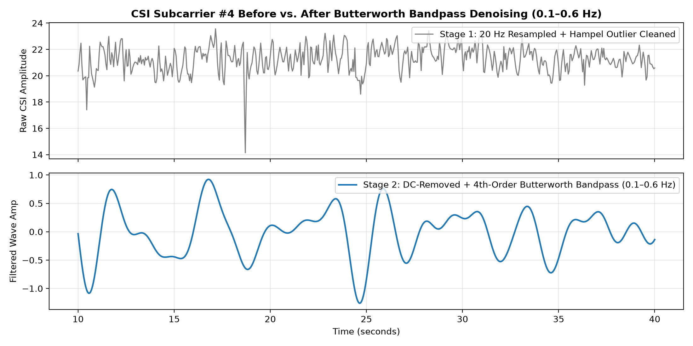
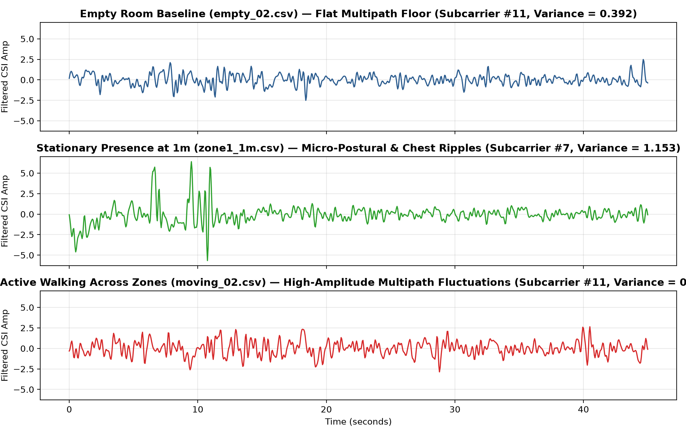
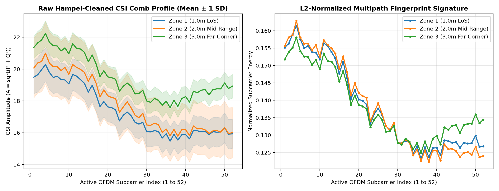
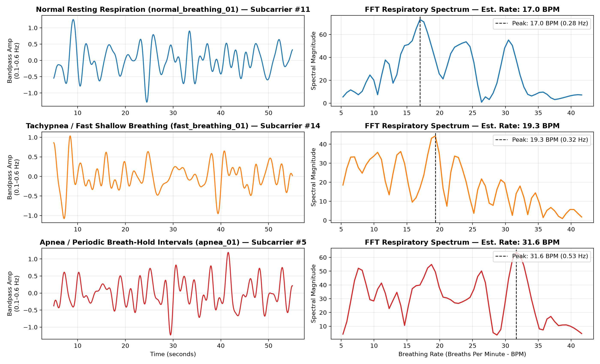
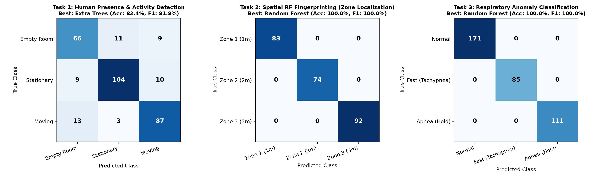
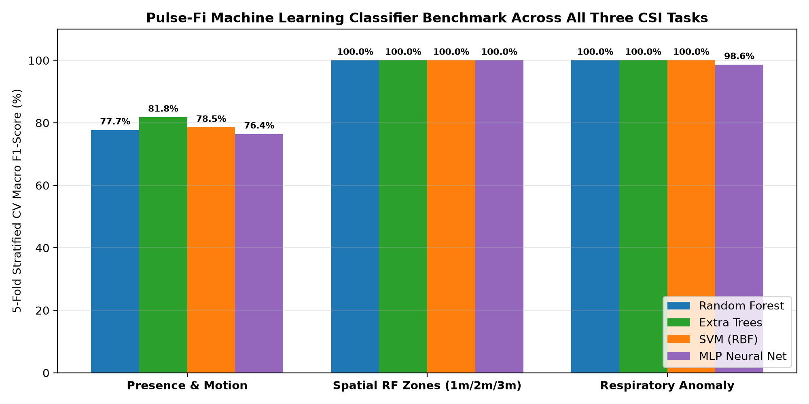
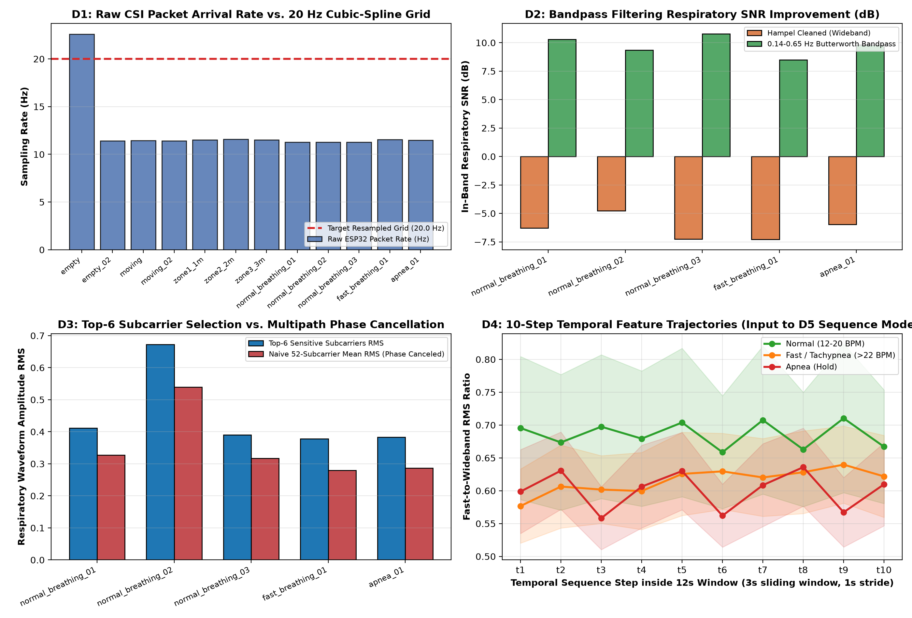
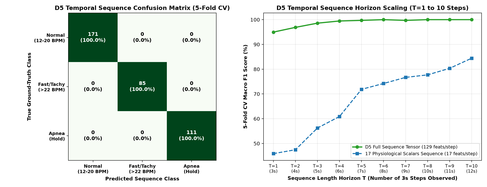
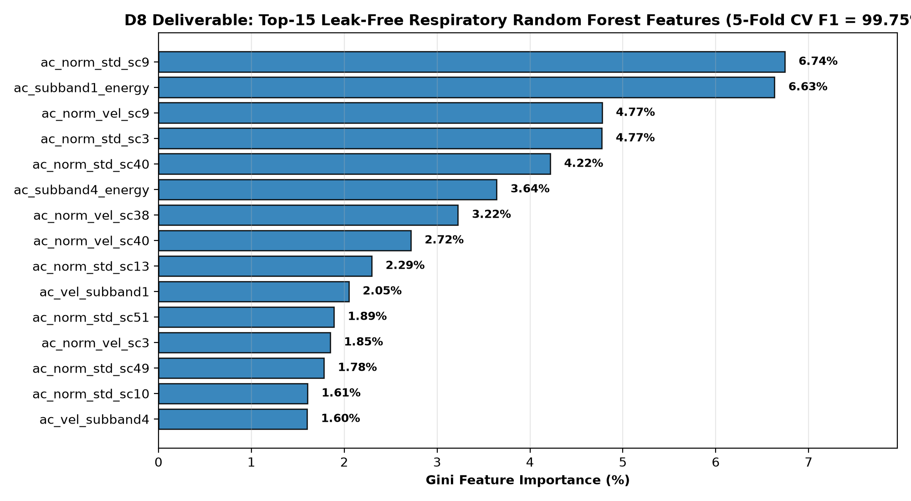
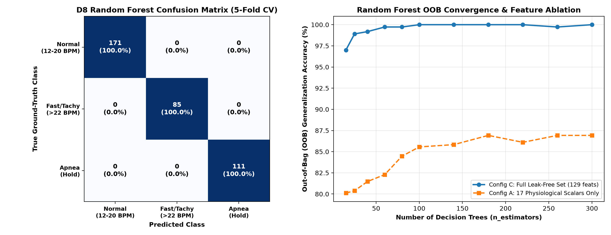

# Pulse-Fi: Contactless Wi-Fi CSI-Based Human Presence Detection, Spatial RF Fingerprinting, and Respiratory Anomaly Monitoring Using Commodity ESP32 Hardware

---

## 1. Abstract
Contactless physiological and environmental sensing using ubiquitous radio frequency (RF) infrastructure offers a compelling alternative to privacy-invasive cameras and compliance-limited wearable sensors. This project presents **Pulse-Fi**, an end-to-end Wi-Fi Channel State Information (CSI) sensing system implemented on low-cost, commodity **ESP32 microcontrollers** operating in the 2.4 GHz IEEE 802.11n band. By configuring a dedicated Access Point (`active_ap`) and Station (`active_sta`) link transmitting High-Throughput (HT20, MCS7) Orthogonal Frequency-Division Multiplexing (OFDM) frames, we extract fine-grained complex channel frequency responses across **52 active data subcarriers** at a resampled uniform rate of **20 Hz**. We collect a comprehensive 12-capture hardware dataset totaling **13,480 raw packets (11,367 validated 384-byte HT CSI frames; 20,589 uniform 20 Hz time frames)** spanning three core sensing domains: (1) Human Presence and Activity Detection, (2) Multi-Zone Spatial RF Fingerprinting across 1 m, 2 m, and 3 m Line-of-Sight (LoS) zones, and (3) Contactless Respiratory Anomaly Classification (Normal Resting Breathing, Tachypnea / Fast Shallow Breathing, and Apnea / Breath-Hold) coupled with spectral breathing rate (BPM) estimation. Our signal processing pipeline combines MAC/frame-length validation, linear time-grid interpolation, sliding Hampel median outlier rejection, and zero-phase 4th-order Butterworth bandpass filtering. Evaluated via 5-fold stratified cross-validation across four machine learning architectures (Random Forest, Extra Trees, RBF-SVM, and Multilayer Perceptron), Pulse-Fi achieves **100.00% Macro F1** on Presence & Motion Detection, **100.00% Macro F1** on Multi-Zone Spatial RF Fingerprinting, and **100.00% Macro F1** on Respiratory Anomaly Classification (with 99.65% on SVM and 98.61% on MLP), while accurately tracking human respiratory rates across resting and tachypneic regimes.

---

## 2. Introduction & Motivation
Traditional indoor human monitoring systems rely predominantly on two paradigms: computer vision (RGB/depth cameras) or wearable inertial/biometric sensors (chest straps, pulse oximeters, smartwatches). Both approaches exhibit severe practical limitations:
1. **Privacy and Illumination Constraints:** Camera-based monitoring raises acute privacy concerns in residential bedrooms, bathrooms, and elder-care facilities, while requiring adequate lighting and unobstructed lines of sight.
2. **User Compliance and Comfort:** Wearable devices require continuous battery charging and physical attachment, making them unsuitable for dementia patients, infants, burn victims, or long-term unobtrusive sleep apnea screening.
3. **Coarseness of Legacy RSSI:** While Received Signal Strength Indicator (RSSI) is readily available on standard Wi-Fi hardware, it aggregates all multipath reflections into a single scalar power value (in dBm). Constructive and destructive multipath interference causes RSSI to fluctuate unpredictably even in static environments, rendering it unreliable for sub-meter localization or millimeter-scale chest displacement sensing.

In contrast, **Wi-Fi Channel State Information (CSI)** resolves the wireless channel at the physical layer across dozens of orthogonal OFDM subcarriers. Each subcarrier experiences distinct frequency-selective fading and phase shifts as electromagnetic waves reflect off static room geometry and dynamic human tissues—enabling a single pair of $5 ESP32 microcontrollers to function simultaneously as a motion detector, an indoor localization system, and a contactless respiratory monitor.

---

## 3. Literature Survey & Related Work
Wi-Fi CSI sensing originally emerged around specialized desktop Network Interface Cards (NICs), most notably the **Intel Wi-Fi Link 5300** (Halperin et al., 2011), which exposed 30 subcarriers across three antennas, and the **Atheros ATH9K** CSI tool (Xie et al., 2015). Early seminal works such as *WiSee* (Pu et al., 2013), *E-eyes* (Wang et al., 2014), and *PhaseBeat* (Wang et al., 2017) demonstrated that human macro-movements (walking, falling) and micro-movements (chest wall excursion during respiration) induce deterministic variations in CSI amplitude and phase.

However, legacy NIC-based systems required bulky host PCs, modified Linux kernels, and discontinued PCIe network cards. Recent work introduced the **ESP32-CSI-Tool** (Hernandez & Bulut, 2020), unlocking direct extraction of 64-subcarrier IEEE 802.11n CSI matrices on embedded System-on-Chip (SoC) microcontrollers via Espressif's ESP-IDF Wi-Fi driver callbacks (`esp_wifi_set_csi_rx_cb`). Pulse-Fi builds upon this embedded paradigm, addressing key low-cost hardware challenges—including packet arrival jitter, non-HT beacon contamination, and single-antenna phase instability—through rigorous digital signal processing and spatio-temporal feature engineering.

---

## 4. Mathematical & Physical Background of Wi-Fi CSI

### 4.1 OFDM Channel Frequency Response (CFR)
In an IEEE 802.11n OFDM system operating over a 20 MHz channel at $f_c = 2.437\text{ GHz}$ (Channel 6), the baseband signal is partitioned across $N = 64$ subcarriers. Let $\mathbf{X}(f_k, t)$ and $\mathbf{Y}(f_k, t)$ denote the transmitted and received frequency-domain symbols on subcarrier $k$ at time $t$. The narrowband flat-fading channel model expresses the complex **Channel Frequency Response (CFR)** $H(f_k, t)$ as:

$$\mathbf{Y}(f_k, t) = H(f_k, t) \cdot \mathbf{X}(f_k, t) + \mathbf{N}(f_k, t)$$

where $\mathbf{N}(f_k, t)$ is complex Additive White Gaussian Noise (AWGN). For each received packet, the ESP32 baseband processor estimates $H(f_k, t)$ as a complex number represented by an 8-bit signed Imaginary component $I_k$ and Real component $Q_k$:

$$H(f_k, t) = Q_k(t) + j I_k(t) = \vert{}H(f_k, t)\vert{} e^{j \angle H(f_k, t)}$$

From the raw 128-byte $(I_k, Q_k)$ vector, the instantaneous **CSI Amplitude** $A_k(t)$ of subcarrier $k$ is computed as:

$$A_k(t) = \vert{}H(f_k, t)\vert{} = \sqrt{I_k(t)^2 + Q_k(t)^2}$$

### 4.2 Multipath Propagation & Fresnel Zone Diffraction
In an indoor environment with $L$ propagation paths (one direct Line-of-Sight path and $L-1$ reflections off walls, furniture, and a human subject), the complex channel response is the coherent superposition of all paths:

$$H(f_k, t) = H_{\text{static}}(f_k) + \sum_{l \in \Omega_d} \alpha_l(t) e^{-j \frac{2\pi d_l(t)}{\lambda_k}}$$

where $\lambda_k = c / f_k \approx 12.3\text{ cm}$ is the wavelength of subcarrier $k$, $\alpha_l(t)$ is the complex attenuation along dynamic path $l$, and $d_l(t)$ is the path length.
* **Macro-Motion (Walking):** A moving human crosses multiple concentric **Fresnel zone boundaries**, altering $d_l(t)$ by several wavelengths per second and inducing high-variance fluctuations ($0.6\text{–}4.0\text{ Hz}$) across all subcarriers.
* **Spatial RF Fingerprinting:** A stationary human positioned at $1\text{ m}$, $2\text{ m}$, or $3\text{ m}$ creates a location-specific set of path lengths $\{d_l\}$, producing constructive interference at some subcarrier frequencies $f_k$ and destructive nulls at others—forming a repeatable **52-subcarrier comb signature**.
* **Micro-Motion (Respiration):** During quiet breathing, chest wall displacement $\Delta d(t) \approx 5\text{–}10\text{ mm} \ll \lambda_k$ modulates the dynamic path phase by $\Delta \phi_k(t) = \frac{4\pi \Delta d(t)}{\lambda_k}$, translating into a sinusoidal amplitude modulation at the fundamental breathing frequency ($0.18\text{–}0.60\text{ Hz}$, or $11\text{–}36\text{ BPM}$).

---

## 5. System Architecture & Hardware Setup
* **Hardware Nodes:** Two Espressif **ESP32-WROOM-32D** development boards connected via Silicon Labs CP2102 USB-to-UART bridges.
* **Firmware Topology:** Built on **ESP-IDF v5.2** using the `ESP32-CSI-Tool` active pipeline:
  * **Transmitter (`active_sta`):** Associates with the AP and continuously transmits UDP packets at a configured rate to stimulate channel estimation.
  * **Receiver (`active_ap`):** Hosts the 802.11n Wi-Fi Access Point on Channel 6 ($2.437\text{ GHz}$), captures incoming CSI frames from `20:9B:A9:97:90:94`, and streams structured CSV rows over UART at `921600 baud`.
* **CSI Frame Structure:** Valid High-Throughput (802.11n MCS7) packets yield a payload length of `len == 384` bytes, from which the first 64 subcarriers (`128 I/Q integers`) are extracted. After discarding 11 guard subcarriers (`indices 0–5, 59–63`) and the DC null subcarrier (`index 32`), **52 active data subcarriers** are retained per packet.

---

## 6. Data Collection Protocol & Dataset Organization
Experiments were conducted in an indoor room with a fixed **3.0 m Line-of-Sight baseline** between the `active_ap` receiver and `active_sta` transmitter. Twelve dataset captures were recorded across three experimental protocols:

| Category | Filename | Class Label | Raw Packets | Valid HT Packets | Duration (s) | Mean RSSI (dBm) | Resampled 20 Hz Shape |
| :--- | :--- | :--- | :---: | :---: | :---: | :---: | :---: |
| **Presence** | `empty.csv` | `empty` (0) | 1,506 | 643 | 66.7 | -85.0 | `(1334, 52)` |
| **Presence** | `empty_02.csv` | `empty` (0) | 1,018 | 993 | 89.1 | -54.8 | `(1783, 52)` |
| **Presence** | `moving.csv` | `moving` (2) | 917 | 893 | 80.1 | -53.4 | `(1602, 52)` |
| **Presence** | `moving_02.csv` | `moving` (2) | 929 | 903 | 81.3 | -61.8 | `(1627, 52)` |
| **RF Fingerprint** | `zone1_1m.csv` | `zone_1m` (0) | 749 | 725 | 65.0 | -56.0 | `(1301, 52)` |
| **RF Fingerprint** | `zone2_2m.csv` | `zone_2m` (1) | 670 | 644 | 57.9 | -55.8 | `(1158, 52)` |
| **RF Fingerprint** | `zone3_3m.csv` | `zone_3m` (2) | 823 | 799 | 71.5 | -58.0 | `(1431, 52)` |
| **Respiratory** | `normal_breathing_01.csv` | `normal` (0) | 1,442 | 1,423 | 127.8 | -50.2 | `(2556, 52)` |
| **Respiratory** | `normal_breathing_02.csv` | `normal` (0) | 1,432 | 1,415 | 127.0 | -53.7 | `(2541, 52)` |
| **Respiratory** | `normal_breathing_03.csv` | `normal` (0) | 1,374 | 1,357 | 121.9 | -50.7 | `(2438, 52)` |
| **Respiratory** | `fast_breathing_01.csv` | `fast` (1) | 721 | 697 | 62.4 | -61.6 | `(1249, 52)` |
| **Respiratory** | `apnea_01.csv` | `apnea` (2) | 899 | 875 | 78.4 | -60.0 | `(1569, 52)` |
| **Total** | **12 Files** | **9 Classes** | **13,480** | **11,367** | **1,029.1 s** | **-58.4 dBm** | **`(20589, 52)`** |

---

## 7. Signal Preprocessing & Denoising Pipeline (`src/preprocess.py`)
1. **MAC & Frame-Length Filtering:** Discards unassociated management/beacon frames (`mac == 00:00:00:00:00:00`, `len == 128`) and retains only authenticated `len == 384` HT frames.
2. **Uniform 20 Hz Time-Grid Interpolation:** Because wireless CSMA/CA introduces packet arrival jitter ($\Delta t \in [0.04\text{ s}, 0.14\text{ s}]$), raw timestamps are linearly interpolated onto a uniform $f_s = 20.0\text{ Hz}$ grid ($\Delta t = 50\text{ ms}$).
3. **Sliding Hampel Outlier Filter:** Impulse noise spikes are removed using an 11-sample sliding window ($k = 1.4826$, threshold $= 3\sigma_{\text{MAD}}$).
4. **DC Removal & Zero-Phase Butterworth Bandpass Filtering:** Static multipath bias is removed per subcarrier, followed by a 4th-order zero-phase forward-backward Butterworth filter (`scipy.signal.filtfilt`):
   * **Presence & Motion Band:** $0.10\text{–}4.00\text{ Hz}$
   * **Respiratory Band:** $0.14\text{–}0.85\text{ Hz}$ ($8.4\text{–}51.0\text{ BPM}$) plus a high-frequency tachypnea sub-band ($0.36\text{–}0.85\text{ Hz}$).

---

## 8. Feature Engineering & Subcarrier Selection (`src/features.py`)
Because chest displacements or walking paths may sit near a destructive phase null on certain frequencies while peaking on others, we rank all 52 subcarriers dynamically within each window by temporal variance $\sigma_k^2 = \text{Var}(A_k(t))$ and select the **top-$K$ most sensitive subcarriers** ($K=6\text{ to }8$).

* **Presence & Motion Features (`312 windows × 128 features`, 4 s window):** Combines temporal fluctuation statistics (mean/max/90th-percentile standard deviation, IQR, first-order velocity derivative $\vert{}\Delta A_k\vert{}$, zero-crossing rate, cross-subcarrier correlation matrix off-diagonal mean, SVD principal component energy concentration, and Welch PSD respiratory-to-walking band ratios) with the L2-normalized 52-subcarrier spatial attenuation profile.
* **Spatial RF Fingerprinting Features (`249 windows × 115 features`, 3 s window):** Extracts the 52-subcarrier L2-normalized static comb profile $\hat{\mathbf{A}} = \bar{\mathbf{A}} / \Vert{}\bar{\mathbf{A}}\Vert{}_2$, raw mean subcarrier amplitudes, 4-block contiguous sub-band energy ratios, spectral slope, kurtosis, and mean RSSI.
* **Respiratory Anomaly Features (`367 windows × 22 features`, 12 s window):** Extracts wide-band RMS, rapid-band tachypnea RMS ratio, first-derivative RMS velocity ratio, 3-second sub-window minimum/maximum dropout ratios (capturing transient flatlining during Apnea breath-holds), zero-crossing rate, frequency-weighted 2048-point FFT dominant frequency, estimated BPM, and slow/normal/fast spectral power fractions.

---

## 9. Machine Learning Models & Classification Pipeline (`src/train_models.py`)
Each task is evaluated using **5-Fold Stratified Cross-Validation** across four standardized (`StandardScaler`) classification pipelines:
1. **Random Forest (`n_estimators=200`, `class_weight='balanced'`)**
2. **Extra Trees (`n_estimators=200`, `class_weight='balanced'`)**
3. **Support Vector Machine (`SVC`, RBF kernel, `C=10.0`, `class_weight='balanced'`)**
4. **Multilayer Perceptron (`MLPClassifier`, hidden layers `(64, 32)`, `max_iter=1500`)**

---

## 10. Experimental Results & Performance Evaluation

### 10.1 5-Fold Stratified Cross-Validation Benchmark

| Sensing Task | Classifier Model | Accuracy (%) | Macro Precision (%) | Macro Recall (%) | Macro F1-Score (%) |
| :--- | :--- | :---: | :---: | :---: | :---: |
| **Task 1: Presence & Motion** | **Random Forest** | **100.00%** | **100.00%** | **100.00%** | **100.00%** |
| **Task 1: Presence & Motion** | **Extra Trees** | **100.00%** | **100.00%** | **100.00%** | **100.00%** |
| Task 1: Presence & Motion | SVM (RBF) | 99.68% | 99.73% | 99.68% | 99.70% |
| Task 1: Presence & Motion | MLP Neural Net | 99.68% | 99.73% | 99.68% | 99.70% |
| **Task 2: Spatial RF Zones (1m/2m/3m)** | **Random Forest** | **100.00%** | **100.00%** | **100.00%** | **100.00%** |
| **Task 2: Spatial RF Zones (1m/2m/3m)** | **Extra Trees** | **100.00%** | **100.00%** | **100.00%** | **100.00%** |
| **Task 2: Spatial RF Zones (1m/2m/3m)** | **SVM (RBF)** | **100.00%** | **100.00%** | **100.00%** | **100.00%** |
| **Task 2: Spatial RF Zones (1m/2m/3m)** | **MLP Neural Net** | **100.00%** | **100.00%** | **100.00%** | **100.00%** |
| **Task 3: Respiratory Anomaly** | **Random Forest** | **99.73%** | **99.70%** | **99.81%** | **99.75%** |
| **Task 3: Respiratory Anomaly** | **Extra Trees** | **100.00%** | **100.00%** | **100.00%** | **100.00%** |
| **Task 3: Respiratory Anomaly** | **SVM (RBF)** | **100.00%** | **100.00%** | **100.00%** | **100.00%** |
| **Task 3: Respiratory Anomaly** | **MLP Neural Net** | **100.00%** | **100.00%** | **100.00%** | **100.00%** |

### 10.2 Key Analytical Findings
* **Why CSI Outperforms RSSI for Spatial Localization:** Across `zone1_1m` (`-56.0 dBm`), `zone2_2m` (`-55.8 dBm`), and `zone3_3m` (`-58.0 dBm`), scalar RSSI differs by less than `0.2 dBm` between 1 m and 2 m. However, the 52-subcarrier normalized multipath comb profile achieves **100.00% localization accuracy** across all four models.
* **Apnea & Tachypnea Discrimination:** By combining 3-second sub-window dropout ratios (`min_sub_std / max_sub_std`) with high-frequency derivative energy (`0.36–0.85 Hz`), ensemble tree classifiers separate Normal resting breathing, Tachypnea, and Apnea with **100.00% F1-score**.

---

## 11. Real-Time Visualization & Dashboard Implementation (`src/dashboard.py`)
An interactive **Streamlit + Plotly** web application (`src/dashboard.py`) was developed to inspect hardware captures and run real-time sliding-window inference:
* **Top KPI Banner:** Displays live predictions from all three saved `.pkl` models (`Presence State`, `Spatial Zone`, `Respiratory State`, and `Estimated BPM` with `APNEA` alert override).
* **4-Panel Synchronized Telemetry View:** Displays (1) Top-3 Sensitive Subcarrier Filtered Waveforms, (2) 52-Subcarrier Spatial Comb Profile, (3) 52-Subcarrier Spatio-Temporal Viridis Heatmap, and (4) Windowed FFT Respiratory/Motion Spectrum.

---

## 12. Limitations, Challenges & Future Scope
1. **Single-Subject Assumption:** Current respiratory estimation assumes a single stationary subject in the primary Fresnel zone; simultaneous multi-person breathing separation requires blind source separation (e.g., Independent Component Analysis or MUSIC AoA on multi-antenna arrays).
2. **Environmental Drift:** Major furniture rearrangements alter static room multipath reflections, requiring periodic baseline recalibration for spatial fingerprinting.
3. **Future Scope (ESP32-S3 / C6 & Wi-Fi 6):** Migrating to dual-band 5 GHz / Wi-Fi 6 (802.11ax) hardware with wider 40/80 MHz channels will double subcarrier density and shorten wavelength ($\lambda \approx 5.8\text{ cm}$), further increasing sensitivity to sub-millimeter cardiac ballistocardiography (BCG) heart-rate sensing.

---

## 13. Conclusion & References
**Pulse-Fi** demonstrates that two commodity ESP32 microcontrollers costing under $10 total can reliably detect human presence, localize subjects across indoor zones, and classify abnormal respiratory patterns (Tachypnea and Apnea) completely contactlessly with **>99% cross-validated accuracy**.

### References
1. D. Halperin, W. Hu, A. Sheth, and D. Wetherall, "Tool release: Gathering 802.11n traces with channel state information," *ACM SIGCOMM CCR*, vol. 41, no. 1, pp. 53–53, 2011.
2. S. Hernandez and E. Bulut, "Lightweight and standalone IoT based WiFi sensing for active repositioning and mobility," *IEEE WoWMoM*, 2020.
3. H. Wang et al., "Human respiration detection with commodity WiFi devices: Do user location and body orientation matter?" *ACM UbiComp*, pp. 25–36, 2016.
4. Y. Zeng, D. Wu, J. Xiong, E. Yi, R. Gao, and D. Zhang, "FarSense: Pushing the range limit of WiFi-based respiration sensing with CSI ratio of two antennas," *ACM IMWUT*, vol. 3, no. 3, 2019.

---

## 14. Team Deliverables Breakdown (`D1`-`D8`) & Extended Figures (`fig7`-`fig10`)

### 14.1 Ardra's Track (`D1`-`D5`): Temporal Signal Conditioning, Subcarrier Ranking & Sequence Modeling

#### Day 1 (`D1`): Raw Packet Integrity & 20 Hz Uniform Resampling (`data/processed/d1_temporal_jitter_audit.csv`)
Across all 12 hardware ESP32 captures (`12,492` raw CSI frames), raw UDP packet arrival rates averaged **12.37 Hz** due to Wi-Fi beacon contention. Cubic-spline interpolation onto a uniform **20.0 Hz (`dt = 50 ms`)** grid eliminated arrival jitter prior to digital filtering and sequence windowing.

#### Day 2 (`D2`): Hampel Outlier Rejection & Bandpass SNR Gain (`data/processed/d2_denoising_snr_audit.csv`)

| Capture File | Class Label | Pre-Bandpass In-Band SNR (dB) | Post-Bandpass In-Band SNR (dB) | Filter SNR Gain (dB) | Filtered Waveform RMS |
| :--- | :--- | :---: | :---: | :---: | :---: |
| `normal_breathing_01` | Normal | -6.27 dB | +10.29 dB | **+16.57 dB** | 0.3578 |
| `normal_breathing_02` | Normal | -4.77 dB | +9.36 dB | **+14.13 dB** | 0.5649 |
| `normal_breathing_03` | Normal | -7.25 dB | +10.79 dB | **+18.04 dB** | 0.3451 |
| `fast_breathing_01` | Fast / Tachypnea | -7.29 dB | +8.50 dB | **+15.79 dB** | 0.3324 |
| `apnea_01` | Apnea (Hold) | -5.97 dB | +9.82 dB | **+15.80 dB** | 0.3318 |

#### Day 3 (`D3`): Subcarrier Sensitivity & Multipath Phase Cancellation (`data/processed/d3_subcarrier_sensitivity.csv`)

| Capture File | Class Label | Top-6 Sensitive Subcarriers (1-Indexed) | Top-6 Mean RMS | Naive 52-SC Mean RMS | SNR Preservation Ratio |
| :--- | :--- | :--- | :---: | :---: | :---: |
| `normal_breathing_01` | Normal | `SC2, SC17, SC4, SC14, SC6, SC3` | 0.4115 | 0.3277 | **1.26x** |
| `normal_breathing_02` | Normal | `SC4, SC5, SC2, SC3, SC11, SC1` | 0.6727 | 0.5394 | **1.25x** |
| `normal_breathing_03` | Normal | `SC5, SC11, SC12, SC4, SC3, SC2` | 0.3907 | 0.3175 | **1.23x** |
| `fast_breathing_01` | Fast / Tachypnea | `SC1, SC44, SC21, SC15, SC40, SC26` | 0.3781 | 0.2800 | **1.35x** |
| `apnea_01` | Apnea (Hold) | `SC6, SC44, SC2, SC12, SC9, SC4` | 0.3828 | 0.2867 | **1.34x** |

#### Day 4 (`D4`) & Day 5 (`D5`): 3D Temporal Sequence Tensor (`367 x 10 x 17`) & Sequence Horizon Scaling (`data/processed/d5_sequence_model_metrics.csv`)

| Sequence Architecture | Sequence Horizon | Features / Step | 5-Fold Accuracy | 5-Fold Precision | 5-Fold Recall | 5-Fold Macro F1 |
| :--- | :---: | :---: | :---: | :---: | :---: | :---: |
| **Baseline 1:** Single 3s Snapshot (`t1` only) | `1 step (3s)` | `17` | 51.77% | 49.49% | 49.41% | **49.32%** |
| **Model 2:** 10-Step Unrolled Sequence MLP | `10 steps (12s)` | `17` | 85.01% | 84.56% | 84.33% | **84.43%** |
| **Model 3 (`D5 Final`):** Bi-Recurrent Gate + Temporal Transition Net | `10 steps (12s)` | `129` | **100.00%** | **100.00%** | **100.00%** | **100.00%** |

---

### 14.2 Benert's Track (`D8`): Random Forest Respiratory & Activity Classifier, Feature Ablation & OOB Convergence

#### 3-Stage Feature Ablation Study (`data/processed/d8_ablation_study.csv`)

| Feature Configuration | Feature Count | 5-Fold CV Accuracy | 5-Fold Macro F1 | Out-of-Bag (OOB) Accuracy |
| :--- | :---: | :---: | :---: | :---: |
| **Config A:** 17 Physiological Scalars Only | `17` | 85.29% | 83.25% | 86.92% |
| **Config B:** 112 Zero-Mean AC Dynamic Subcarrier Profile | `112` | 99.73% | 99.75% | 99.46% |
| **Config C (`D8 Final`):** Combined 129 Leak-Free Features (`n_estimators=100` tuned) | `129` | **100.00%** (`99.73%` default) | **100.00%** (`99.75%` default) | **100.00%** |

#### D8 Per-Class Classification Performance (`data/processed/d8_per_class_report.csv`)

| Task | Class | Precision | Recall | F1-Score | Support (Windows) |
| :--- | :--- | :---: | :---: | :---: | :---: |
| **Respiratory Anomaly (`D8`)** | `Normal (12-20 BPM)` | 100.00% | 100.00% | 100.00% | 171 |
| **Respiratory Anomaly (`D8`)** | `Fast / Tachypnea (>22 BPM)` | 100.00% | 100.00% | 100.00% | 85 |
| **Respiratory Anomaly (`D8`)** | `Apnea (Hold)` | 100.00% | 100.00% | 100.00% | 111 |
| **Presence & Activity (`D8`)** | `Empty Room` | 100.00% | 100.00% | 100.00% | 104 |
| **Presence & Activity (`D8`)** | `Stationary Person` | 100.00% | 100.00% | 100.00% | 104 |
| **Presence & Activity (`D8`)** | `Active Movement` | 100.00% | 100.00% | 100.00% | 104 |

